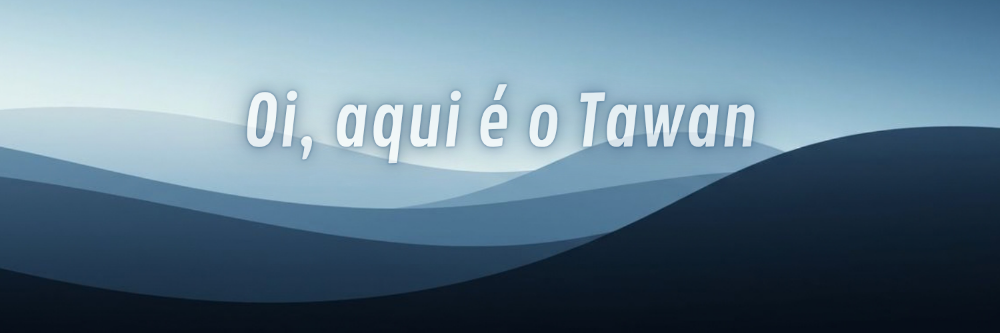

<!-- Banner -->

  

<!-- Redes / Conexão -->

  
  &nbsp;
  
  <!-- &nbsp;  -->

<!-- Sobre Mim -->
<h3 align="center">Sobre Mim</h3>

  

Estudante de Engenharia de Software na <b>UnB</b>, atuando como monitor de Álgebra Linear.
  
Estou construindo minha base em <b>HTML</b>, <b>CSS</b>, <b>JavaScript</b> e <b>Python</b>, com foco em transformar teoria em projetos práticos.
  
Gosto de aprender coisas novas e estou sempre testando ideias e ferramentas diferentes pelo caminho.

 

<!-- Tecnologias -->
<h3 align="center">Tecnologias</h3>

  
  &nbsp;&nbsp; | &nbsp;&nbsp;
  

<!-- Além dos Códigos -->
<h3 align="center">Além dos Códigos</h3>

 

• &nbsp; Entusiasta de academia 
• &nbsp; Criando o hábito de ler 
• &nbsp; SYML, Shawn James, George Ogilvie no fone 
• &nbsp; Rain World, ainda tentando sobreviver <i>(o slugcat aí do lado sabe bem)</i>

 

 

  <i>"Grandes coisas não são feitas por impulso, mas por uma série de pequenas coisas reunidas."</i>
    
  <b>— Vincent van Gogh</b>

